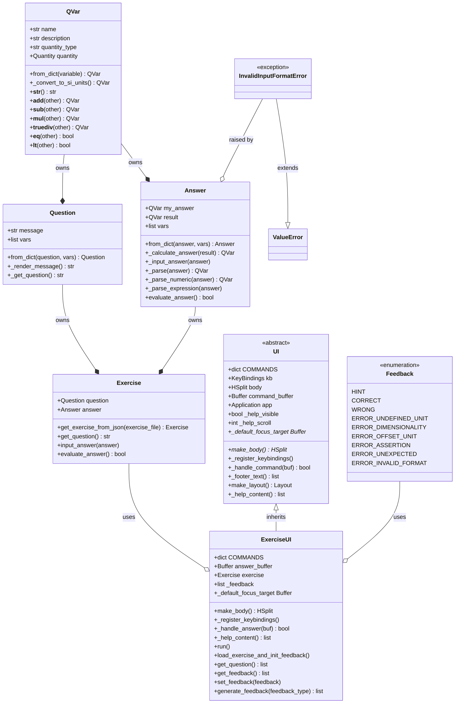

# Contributing

## Code Style

### PEP 8

All Python code must follow [PEP 8](https://peps.python.org/pep-0008/). Key rules:

- Indentation: 4 spaces, no tabs.
- Maximum line length: 88 characters.
- Two blank lines between top-level definitions; one blank line between methods.
- Imports: one per line, grouped in order — standard library, third-party, local. Separated by blank lines.
- Naming: `snake_case` for functions and variables, `PascalCase` for classes, `UPPER_CASE` for constants.

This project uses `ruff` to enfore this automatically.

### Type Annotations

All public and private functions and methods must have type annotations on parameters and return types.

```py
def get_character_introduction(name: str, age: int) -> str:
    return f"Hello, my name is {name} and I am {age} years old!"
```

**Exception:**

The Python special methods such as:

- `__init__`
- `__new__`
- `__call__`

are not required to have **return type annotations**.
However the other special methods such as `__add__`, `__sub__`, `__eq__` do require return type annotations.

#### Forward References and `Self` (PEP 673)

When a classmethod returns an instance of its own class, use `Self` from `typing_extensions` (Python < 3.11) or `typing` (Python ≥ 3.11):

```python
# annotations are required on Python 3.9 to defer annotation evaluation
from __future__ import annotations 
from typing_extensions import Self

class MyClass:
    def __init__(self, my_var:float):
        self.my_var = my_var

    @classmethod
    def construct_from_dict(cls, data: dict) -> Self:
        return cls(my_var=data["value"])
    
    def __add__(self, other:MyClass):
        ...
```

`Self` is preferred over a quoted forward reference (`-> "Answer"`) for classmethods because it is semantically accurate: it refers to whatever class `cls` is, including subclasses. A quoted string annotation would incorrectly fix the return type to the base class and break subclass correctness.

> The `Self` type annotation is also useful for classmethods that return an instance of the class that they operate on.

See [PEP 673](https://peps.python.org/pep-0673/) for the full specification.

### Type Checking with `mypy`

Ruff (`ANN` rules) only checks that annotations exist.
`mypy` verifies that they are correct — catching type mismatches, wrong return types, and incompatible arguments at static analysis time.
This project runs mypy in strict mode (`strict = true` in `pyproject.toml`), which enables the full PEP 484 strict bundle.
All code must pass mypy without errors before merging.

## Docstrings

All public modules, classes, and functions must have docstrings. Use the Google style:

```python
def prompt_qa(question: str) -> float:
    """Asks the user a question and prompts an answer.

    Args:
        question(str): The question to display to the user.

    Returns:
        float: The user's answer parsed as a float.

    Raises:
        ValueError: If the input cannot be converted to float.
    """
```

Rules:

- First line: a single short sentence, imperative mood, ending with a period.
- Leave one blank line before `Args`, `Returns`, and `Raises` sections.
- Omit sections that do not apply.
- Private methods (prefixed `_`) may omit docstrings if their purpose is obvious from context, but public API must always have them.

## Running Code Checks

Run the following commands from the project root before committing, in this order:

```bash
ruff format .       # reformat code
ruff check [--fix]  # lint
mypy .              # type-check
```

Order matters: format before lint, otherwise ruff check may flag issues the formatter would have resolved.

## Overwiew over the code

